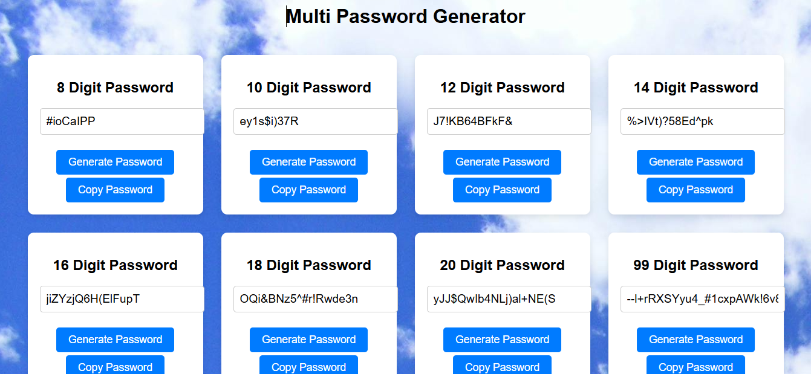

# 🛠️ Multi-Length Random Password Generator 🔐

A simple web app that generates random passwords of different lengths (8, 10, 12, 14, 16, and 20 digits). Users can generate a password for each length and easily copy it to the clipboard. Great for creating strong passwords for your accounts and applications!

## Features ✨
- 🔢 Generate random passwords of 8, 10, 12, 14, 16, and 20 characters.
- 📋 Copy passwords with a single click.
- 🔐 Passwords include uppercase, lowercase, numbers, and special characters.
- 🎨 Simple and user-friendly interface.

## 🖥️ How to Use
1. **Clone or Download** the repository to your local machine.
   ```bash
   git clone https://github.com/yourusername/password-generator.git



**Open the index.html file in any modern browser (Chrome, Firefox, Safari, etc.).
**Generate a password by clicking the "Generate Password" button under the desired length.
**Copy the generated password by clicking the "Copy Password" button next to it.

🧑‍💻 Technologies Used
HTML5 - Structure of the web page.
CSS3 - Styling the layout and design.
JavaScript - For generating random passwords and copying to clipboard.
🖼️ Screenshot

🤖 Example Passwords
8-digit: A1b2C3d4
10-digit: XyZ@1234aB
12-digit: 3uF#9p@Lk12Q
14-digit: Xb1!T2dL@R8q9V
16-digit: Y7$N6vZk!aB8d9Jw
18-digit: OQi&BNz5^#r!Rwde3n
20-digit: J2G@k9bA!Z1wLq8rF0E

🚀 How It Works
Click on the "Generate Password" button to generate a random password.
The generated password will appear in the input field.
Click the "Copy Password" button to copy the password to your clipboard.
You can now use the password for your applications, accounts, or other secure systems!

🤝 Contributing
Feel free to fork this repository and submit a pull request if you'd like to contribute! All contributions are welcome! 😊

🔑 License
This project is licensed under the MIT License - see the LICENSE file for details.

📄 Credits
Inspired by the need for secure, random password generation.
Built with ❤️ by Afzal khan.
